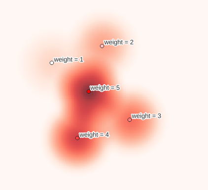

# Spatial Kernel Density Esimation
Create Spatial Kernel Density / Heatmap raster from point based vector data, à la QGIS / ArcGIS.



Creates a kernel density (heatmap) raster from vector point data using kernel density estimation. The density is calculated based on the number of points in a location, with larger numbers of clustered points resulting in larger values, and points can be optionally weighted. Kernel Density / Heatmaps allow easy for identification of hotspots and clustering of points. This implementation provides an equivalent to [QGIS' Heatmap](https://docs.qgis.org/3.16/en/docs/user_manual/processing_algs/qgis/interpolation.html#heatmap-kernel-density-estimation) and [ArcGIS/ArcMap/ArcPro's Kernel Density spatial analyst](https://pro.arcgis.com/en/pro-app/latest/tool-reference/spatial-analyst/kernel-density.htm) function. Note that any distance calculations are planar, therefore care should be taken when using points over large areas that are in a geographic coordinate system.

The implementation of kernel density uses the Quartic kernel for it's estimates, with the methodology implemented [following QGIS](https://github.com/qgis/QGIS/blob/master/src/analysis/raster/qgskde.cpp) and as described in ArcGIS' documentation explaining [how Kernel Density works](https://pro.arcgis.com/en/pro-app/latest/tool-reference/spatial-analyst/how-kernel-density-works.htm). There are many alternative kernel density estimate (KDE) functions available in popular python libraries that may offer better performance, for example [scipy](https://docs.scipy.org/doc/scipy/reference/stats.html#univariate-and-multivariate-kernel-density-estimation), [scikit-learn](https://scikit-learn.org/stable/modules/generated/sklearn.neighbors.KernelDensity.html), [KDEpy](https://kdepy.readthedocs.io/en/latest/index.html) etc., though these alternatives may not implement the Quartic kernel (with optional weights), as is typically found in GIS software. Additionally, performance with this package will be reduced compared to the native C++ implementaion in QGIS.

## Installation

The package can be installed from pip:

```shell
pip install spatial-kde
```

## Usage

After installation, the `skde` tool is available from the command line with the following usage:

```shell
Usage: skde [OPTIONS] VECTOR OUTPUT

  Create a Spatial Kernel Density / Heatmap raster from an input vector.

  The input vector file must be readable by GeoPandas and contain Point type
  geometry (for non-point geometries the centroid will be used for the KDE).

Arguments:
  VECTOR  Path to input vector file  [required]
  OUTPUT  Output path for created raster  [required]

Options:
  --radius FLOAT                  Radius/Bandwith for the KDE. Same units as
                                  the CRS of `vector`.  [default: 1]
  --output-pixel-size FLOAT       Output pixel size (resolution). Same units
                                  as the CRS of `vector`.  [default: 1]
  --output-driver TEXT            Output driver (file format) used by rasterio
                                  (Default = GeoTiff).  [default: GTiff]
  --weight-field TEXT             Optional field in `vector` containing
                                  weights of each point.
  --scaled / --no-scaled          Set to True to scale the KDE values, leave
                                  false to use raw values.  [default: no-
                                  scaled]
```

Alternatively, the [`spatial_kernel_density`](spatial_kde/kde.py) function can be used in python:

```python
from typing import Optional

import geopandas as gpd
from spatial_kde import spatial_kernel_density


spatial_kernel_density(
    points: gpd.GeoDataFrame = gdf,
    radius: float = 1.0,
    output_path: str = "/output/path.tif",
    output_pixel_size: float = 1.0,
    output_driver: str = "GTiff",
    weight_col: Optional[str] = None,
    scaled: bool = False,
)

    """Calculate Kernel Density / heatmap from ``points``

    .. note:: Distance calculations are planar so care should be taken with data
              that is in geographic coordinate systems

    Parameters
    ----------
    points : gpd.GeoDataFrame
        Input GeoDataFrame of points to generate a KDE from
    radius : float
        Radius of KDE, same units as the coordinate reference system of ``points``
        Sometimes referred to as search radius or bandwidth
    output_path : str
        Path to write output raster to
    output_pixel_size : float
        Output cell/pixel size of the created array. Same units as the coordinate
        reference system of ``points``
    output_driver : str
        Output format (driver) used to create image. See also
        https://rasterio.readthedocs.io/en/latest/api/rasterio.drivers.html
    weight_col : Optional[str], optional
        A column in ``points`` to weight the kernel density by, any points that
        are NaN in this field will not contribute to the KDE.
        If None, the all points will have uniform weight of 1.
    scaled : bool
        If True will output mathematically scaled values, else will output raw
        values.
    """
```

## Development

Prequisites:

* [poetry](https://python-poetry.org/)
* [pre-commit](https://pre-commit.com/)

The Makefile includes helpful commands setting a development environment, get started by installing the package into a new environment and setting up pre-commit by running `make install`. Run `make help` to see additional available commands (e.g. linting, testing and so on).

* [Pytest](https://docs.pytest.org/en/6.2.x/) is used for testing the application (see `/tests`).
* Code is linted using [flake8](https://flake8.pycqa.org/en/latest/)
* Code formatting is validated using [Black](https://github.com/psf/black)
* [pre-commit](https://pre-commit.com/) is used to run these checks locally before files are pushed to git
* The [Github Actions pipeline](.github/workflows/pipeline.yml) runs these checks and tests

## TODO

- [ ] Github actions pipeline runs on a matrix of python versions
- [ ] Documentation (e.g. mkdocs, read-the-docs w/ sphinx or similar)
- [ ] Tooling for managing versioning/releasing (e.g. bump2version)
- [x] Makefile commands for releasing to (test) pypi
- [ ] Support geodesic distance calculation
- [ ] Performance improvements